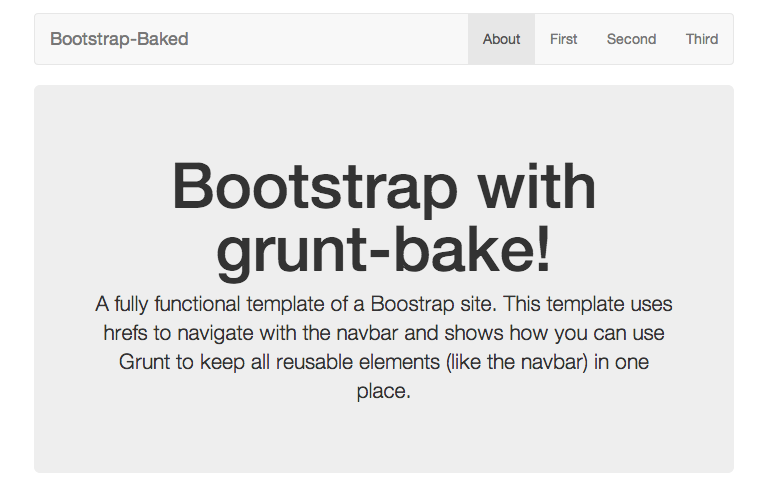
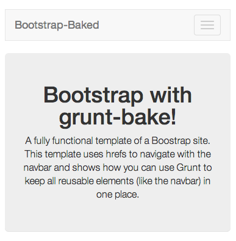

# bootstrap-baked

> A template of a Bootstrap site with a DRYed out navbar and footer using grunt-bake.

## Overview

[Bootstrap] (http://getbootstrap.com/) is a great framework for building
webpages. [Yeoman] (http://yeoman.io/) and the [webapp generator] (https://github.com/yeoman/generator-webapp)
are great ways to get started with a full featured website. However, the
structure of the site it starts you out with is pretty minimal. For example,
the navbar isn't configured by default. This repo starts you out with a Boostrap
site that uses hrefs to to navigate via the navbar. Further, the html for the
navbar and footer are DRYed out using the [grunt-bake] (https://github.com/MathiasPaumgarten/grunt-bake)
templating engine.

The default tasks that ship with `yo webapp` have been reconfigured
to play nice with grunt-bake. I've also changed the default `nav-pills` style
navbar that ships with `yo webapp` to instead use a responsive navbar that
resizes and changes to a dropdown on small screens. A couple small bugs with
yo webapp 1.1.2 have also been fixed.

You can use this project as a starting point for you own sites, as well as an
example of how to use grunt-bake with the webapp tasks.


### On a Desktop:
<p align="center">
  
</p>

### On Mobile, with Navbar Resized
<p align="center">
  
</p>

## Getting Started

If you've used yeoman, generator-webapp, and Grunt before, this will all seem
pretty familiar. If you've also used grunt-bake you're basically good to go.
Clone the repo and run:

```shell
npm install
bower install
```

This will pull down the Grunt and bower-managed packages we need for the site.
Since I've checked in the output files from the template, you can then just
take a look at the site by running `grunt serve`. This should pop you into your
default web browser on `localhost:9000` and let you peruse the site.

If you've never used yeoman or grunt, take a look at the getting started
sections of their websites. Once you get the hang of using these tools it will
be hard to live without them. I would recommend starting with yeoman. In
particular, [try this] (http://yeoman.io/gettingstarted.html). It will get you
started with Grunt and the webapp generator, which is what this project is
based on.

## What's the Point?

I started working on this when I couldn't find any sort of consensus on the
best way to use the Bootstrap navbar. Some people favor the 'very tall page'
approach, where clicking a navbar item scrolls you to a particular place.
Bootstrap includes `scrollspy.js`, which is a common way to accomplish this.
Personally, however, I find this approach disorienting. I often find myself
doing battle with the site by trying to get back up by scrolling through lots
of content. A second approach is to show and hide divs with each nav item.
This seems to be especially true of the tabbed navbar.

Both of these approaches also mean that initial page loads are bigger than they
have to be, as you're loading content that the user might never ask to see. I
haven't done any sort of testing on this, but it seems like it would get
unsustainable as sites grow.

My preferred solution is to have each navbar item just take you to a new page
via an href. This is also how [the Bootstrap page itself] (http://getbootstrap.com/)
seems to be doing things. I also like this approach because you're not hiding
things from the user, but remain completely transparent about what you're
doing. As a user myself, I appreciate this approach.

However, to keep the UI consistent (which you should do!), you end up with
multiple `.html` files that are sharing the same content. The navbar is a great
example. You want this to be identical across all the top level pages. Let's
say you have five top level pages that should share a navbar--this means you
would need the navbar code in five places. Say you want to make a change. Do
you change it in five places? No! Don't Repeat Yourself. DRY it out.

One way to do this is with a template engine. This project does precisely this
by using grunt-bake. The
code for the navbar is defined in `appPreBake/includes/navbar.html`, and it is
added to other the final `.html` files using templates. That way when you want
to make a change you only have to change it in one place.

### Bug Fixes

Yo webapp 1.1.2 has two issues I've encountered. The first is that glyphicons
aren't correctly copied to the `dist` folder in the default installation, but
they are here. Take a look in the Gruntfile for details.

The second is that the imagemin task sometimes hangs, fails, or produces images
of size zero. A fix for this is to not cache the images. This is not enabled by
default, since caching is usually good. If you encounter any of these problems,
try following the instructions to fix it near the imagemin task in the
Gruntfile.

## How it Works

The vast majority of the cool stuff here is due entirely to yeoman and
grunt-bake. For a complete description, see those resources.

### The Gruntfile

The Gruntfile here differs from the `yo webapp` Gruntfile only in the addition
of [the bake task] (https://github.com/MathiasPaumgarten/grunt-bake#the-bake-task)
in several places.

Below are the relevant portions. Keep in mind that this is not the complete
Gruntfile. In the `config` object we are defining a place for the templates in
`appPreBake`. In the configuration of the bake task we tell grunt-bake to
use the templates in `appPreBake` to generate the html pages. In the code
below, for example, `app/index.html` will be generated from `appPreBake.html`.

```js
grunt.initConfig({

    // Project settings
    config: {
        // Configurable paths
        app: 'app',
        dist: 'dist',
        prebake: 'appPreBake'
    },

    bake: {
        build: {
            options: {
                basePath: 'appPreBake'
            },
            files: {
                // Files that use templates should live in appPreBake.
                // Add new files to the list below so that they will be
                // added to the app/ folder, where they are served for the
                // test server. When built they are compiled and put in the
                // dist folder.
                //
                // grunt-bake adopts the formula:
                // outputFile: templateFile
                '<%= config.app %>/index.html': '<%= config.prebake %>/index.html',
                '<%= config.app %>/first/index.html': '<%= config.prebake %>/first/index.html',
                '<%= config.app %>/second/index.html': '<%= config.prebake %>/second/index.html',
                '<%= config.app %>/third/index.html': '<%= config.prebake %>/third/index.html'
            }
        }
    },
    ...
})
```

Per the instructions in the grunt-bake README, we've also modified the watch
task to ensure that we generate the output files whenever the templates (the
files in `appPreBake`) are modified:

```js
watch: {
    // We want to rerun bake every time we change a template file in
    // the prebake directory.
    bake: {
        files: ['appPreBake/**'],
        tasks: 'bake:build'
    },
    ...
}
```

And finally, we add the bake task to the list of tasks that is run when we
execute the build task. Note that we're running the bake task <b>before</b>
the other tasks, as the other tasks come down configured from `yo webapp` to
rely on files in the `app` directory.

```js
grunt.registerTask('build', [
    'clean:dist',
    'bake',
    'useminPrepare',
    'concurrent:dist',
    'autoprefixer',
    'concat',
    'cssmin',
    'uglify',
    'copy:dist',
    'rev',
    'usemin',
    'htmlmin'
]);
```

## What are we Baking?

Exactly what files are we using for templates? The things we're sharing
between pages. You can see the files in `appPreBake/includes`.
These include:

* The navbar (`appPreBake/includes/navbar.html`)
* The footer (`appPreBake/includes/footer.html`)
* The css imports (`appPreBake/includes/doCss.html`). We need this because the
yeoman tasks rely on concatenation and uglification that generate different
versions of the css files for the debug and distribution versions. Rather than
duplicate this code every time I generate a new file, I've put it in a template.
See [the usemin task] (https://github.com/yeoman/grunt-usemin) for more
information.
* The script imports (`appPreBake/includes/doScripts.html`). We do this for the
same reason as the css files.

## What's Next?

If I have the time, I might end up converting this to a full yeoman generator.
